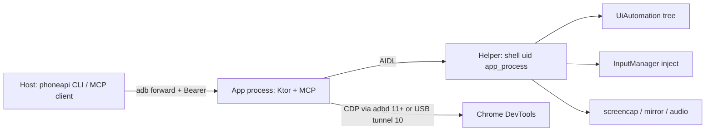

# PhoneAPI architecture

PhoneAPI is meant to feel like giving a robot their first cell phone: install the app, plug it in, and use it. The robot has neither eyes nor fingers, so the app has to help it see the screen and act without asking a human to babysit each step.

Seeing is primarily by way of a structured UI tree (Android's a11y tree or Chrome's AX tree). Screenshots are available a last resort for the client to give to its own vision model. Input looks like what a person would do: real touchscreen events with slight randomization on position and timing and typing that prefers tapping keys over dumping text into a field.

A small helper daemon runs as the `shell` user (uid 2000) via `app_process`, usually started with `phoneapi helper` over `adb shell` (or restarted later over Wireless Debugging). The `shell` user isn't root, but does have significantly elevated permissions over what a normal app is allowed to do.

## Overview



| Piece | Role |
| --- | --- |
| **`app/`** | Settings UI, `ListenerService`, Ktor REST/WebSocket/MCP on an abstract local socket, token store, CDP orchestration, encoders, viewer assets |
| **`helper/`** | Separate `app_process` as shell UID: UiAutomation snapshots, motion/key injection, screencap, display mirror, DevTools socket relay, logcat |
| **`api-model/`** | Shared `@Serializable` DTOs; same types drive MCP tool schemas and `GET /v1/openapi.json` |
| **`scripts/phoneapi`** | Production client (pair, server, helper, papi, mcp) |
| **`scripts/phoneapi-dev`** | Repo wrapper: debug package, `.dev/pairing.json`, `setup` |

The app is plain Kotlin: `AppGraph` is the composition root. Ktor and MCP sit on a `ServerServices` boundary so routes can be tested with fakes.

## Transport: abstract socket + ADB only

The API listens on an Android **abstract** `LocalServerSocket` named after the package. A computer reaches it with:

```text
adb forward tcp:<port> localabstract:<package>
```

then talks HTTP to `http://127.0.0.1:<port>`.

`ListenerService` (foreground, `specialUse`) holds that socket. The host starts it with `phoneapi helper` (`am start-foreground-service`). `phoneapi server` only installs the `adb forward` onto that socket.

Unauthenticated or unknown Bearer tokens get an **empty 404** (no banner).

## Pairing and auth

Bearer tokens are minted over ADB (`CREATE_TOKEN` through `ShellCommandReceiver`, DUMP-protected). The shell user is already trusted, so the phone does not need an Allow dialog for that path. `phoneapi pair` writes pairing JSON (scheme `http`, host `127.0.0.1`, port, token) to `~/.config/phoneapi/pairing.json`. `phoneapi server` installs the forward from that file.

Scopes: `observe`, `control`, `browser`, `stream`, `admin`. Routes and MCP tools are gated by scope and by `capabilities` from `/v1/device`. `?access_token=` is only for WebSocket upgrades and `GET /viewer` (which sets a cookie and redirects), not for `/mcp`.

Wireless Debugging pairing on Android 11+ is a separate concept. It allows the app to self-pair so the helper and Chrome DevTools keep working without USB.

## App vs helper

Chrome’s DevTools socket and realistic input injection are not available to a normal app UID. The helper runs as `shell` (or root on some emulators) via `app_process`, registers over a protected Binder provider, and detaches with `setsid` so it survives the `adb shell` session ending.

The helper is required for UI tree, injected input, screenshots, logcat, browser CDP plumbing, and streams. Without it, capabilities shrink; wake/launch still have limited fallbacks.

Status reported on `/v1/device`: `running`, `starting`, `needs_pairing`, `needs_usb`, `stopped`.

## Seeing the screen

Primary vision is a compact tree, not a pixel dump. Format for agents looks like `[e12] button "Sign in"` with bounds and state.

- **Android UI:** helper UiAutomation (`SnapshotEngine`, refs, find, node actions).
- **Chrome:** CDP Accessibility domain (`Accessibility.getFullAXTree`), not the DOM. The DOM is used for scroll-into-view, quads, and similar action plumbing.
- Prefer tree → find → act / tap over screenshots.
- Screenshot is helper `screencap -p`, marked as a last resort for agents.

## Input

All touches and keys go through helper InputManager injection, stamped as a real touchscreen source (not accessibility `dispatchGesture`, which newer Android can flag). Humanization (jitter, curved swipes, short holds) defaults on for person-like motion. The viewer streams live multi-touch on `WS /v1/input/pointer` instead of replaying a finished path. The socket closing cancels the gesture, which releases the touch.

`tap` injects coordinates; `ui_act` can use semantic `performAction` or resolve a ref to a real touch. Text modes: `auto` (prefer tapping keyboard keys via a11y labels when possible), `keyboard`, `keyevent`, `setText`.

## Browser / CDP

Control is raw CDP against `@chrome_devtools_remote` (and WebViews that publish DevTools), not ChromeDriver.

- **Android 11+:** the app opens Chrome’s socket through adbd (`CdpForward` / Kadb). Wireless Debugging must be available. The helper is not on this byte path.
- **Android 10:** USB forward/reverse tunnel (`phoneapi_cdp`); the helper connects to the reverse socket and relays bytes. `phoneapi helper` sets the tunnel up.

The app owns the CDP session policy (compact AX snapshots, humanized taps through the helper, isolated-world evaluate, avoid enabling Debugger/Emulation by default). Browser tap, swipe, gesture, key, and text default to bringing the tab forward and injecting a hardware event. `input=cdp` sends `Input.dispatchTouchEvent`, `Input.dispatchKeyEvent`, or `Input.insertText` to that target and leaves a background tab where it is. Streaming video/audio is for the human viewer (WebCodecs), not MCP tools.

## Host client

| Command | Job |
| --- | --- |
| `phoneapi pair` | Mint token, save pairing file (no forward, no secret on stdout) |
| `phoneapi server` | `adb forward` API socket to localhost |
| `phoneapi helper` | Start listener + helper (and Android 10 CDP tunnel) |
| `phoneapi papi` | REST / WebSocket calls |
| `phoneapi mcp` | Stdio MCP ↔ `POST /mcp` (also installs the localhost forward) |
| `phoneapi-dev setup` | Debug build/install/grant/pair/server/helper for developers |

Production defaults to package `net.die.phoneapi` and `~/.config/phoneapi/`. Dev defaults to `net.die.phoneapi.dev` and `.dev/pairing.json`.

## Agent loop

The intended loop for an LLM client:

1. `ui_snapshot` / `ui_find` (tree)
2. `tap` / `ui_act` / `type_text` / `press_key`
3. `wait_for` (window / node / browser conditions)
4. `browser_*` when the work is in Chrome
5. `screenshot` only when the tree is not enough

MCP exposes that curated set. Raw CDP WebSocket, token admin, and media streams stay off the tool catalog.

## Caveats

This stack is closer to scrcpy / wireless-debugging tooling than to a normal Play app. Expect breakage on OEM skins and new Android releases.

### Shell helper

Running a long-lived daemon as the `shell` user via `app_process` + `setsid` is non-standard. It is not an app component Android manages for you. Package updates, OEM process killers, and “USB debugging revoked” all take it down; Wireless Debugging auto-restart only covers some of that on Android 11+.

The helper’s Binder registration uses a protected ContentProvider and reflection through `ActivityManager.getService` / `IContentProvider` because a plain `ContentResolver.call` from `app_process` is rejected (no registered app identity).

### Hidden and privileged APIs

The helper calls into framework internals that apps are not supposed to use. On load it tries `VMRuntime.setHiddenApiExemptions("L")` so the targetSdk blacklist does not block those lookups. Anything in this list can move or vanish:

| Area | What we call |
| --- | --- |
| UiAutomation | `UiAutomationConnection`, hidden `UiAutomation.connect` / `disconnect` |
| Input | `ServiceManager.getService("input")`, `IInputManager.injectInputEvent` (arity varies by release) |
| Display mirror | Hidden `DisplayManager` mirror APIs; fallback `SurfaceControl.createDisplay` / `openTransaction` / `setDisplaySurface` / `destroyDisplay`, plus `DisplayManagerGlobal` |
| Audio | `REMOTE_SUBMIX` capture (`CAPTURE_AUDIO_OUTPUT`, shell-only) |
| Privileges | Optional `WRITE_SECURE_SETTINGS` (adb grant) so the app can re-enable Wireless Debugging after reboot; `DUMP` for `CREATE_TOKEN` |

Video encoding also uses `MediaFormat.KEY_LOW_LATENCY` where the codec claims support; that key is not equally real on every device.

### Other odd corners

- **Custom Ktor engine.** CIO only binds filesystem Unix sockets. `AbstractHttpEngine` accepts Android abstract `LocalServerSocket` connections and feeds them into CIO’s pipeline, including a reflective call into an internal `CIOApplicationCall` release method (`@InternalAPI`).
- **ADB is the trust boundary.** Anyone with a debugging session can mint tokens and drive the device. That is intentional; it is also why there is no LAN API anymore.
- **Chrome DevTools path is split and fragile.** Android 11+ needs Wireless Debugging (and often leaves it on). Android 10 needs a USB forward/reverse dance. Emulators sometimes need `adb root` before Chrome accepts the shell uid. Chrome itself must be publishing `@chrome_devtools_remote`.
- **Node refs are not forever.** Stable ids need Android 13+ (`ui.stableIds`); older builds synthesize refs that can churn across snapshots.
- **Humanization is best-effort.** Injected touches aim to look like a real touchscreen; apps and Play integrity can still treat “USB debugging + shell helper” as a hostile environment.
- **`FLAG_SECURE` and OEM policy.** Secure windows are black in captures; some devices further restrict shell capture, submix audio, or display mirroring.
- **Not a Store-shaped app.** Foreground `specialUse` listener, shell helper, hidden APIs, and adb provisioning are fine for sideload / enterprise; they are not a normal Play distribution story.
- **Unlock / PIN.** Stored PIN unlock taps the system keyguard UI. Layout changes, biometrics-only policies, or pattern/password locks will fail closed (`needs_user` / no keypad).

## Related docs

- End-user install and quick start: [README](../README.md)
- HTTP, WebSocket, MCP, and OpenAPI: [api.md](api.md)
- Building, `phoneapi-dev`, tests and linters: [development.md](development.md)
